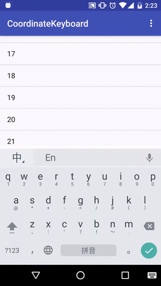
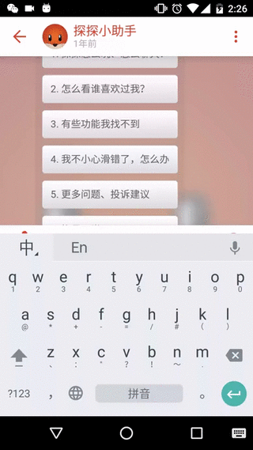

#简介

仿探探聊天界面弹键盘的动画，只是一个粗糙的框架。灵感来源于design库的CoordinateLayout 和 SnackBar,
可以方便接入ListView or RecyclerView or whatever.

#注意事项

``
android:windowSoftInputMode="adjustNothing"
``

windowSoftInputMode 只能是 adjustNothing， 点击输入框弹出键盘并不会改变窗体的大小,整个view只是做了
translationY的位移动画，但这样也没办法知道soft keyboard 的高度，以及监听到键盘弹出或收缩。所以目前
我把底部表情panel 和 功能panel的高度写死了，我用的手机是nexus 5, stock google keyboard.高度是260dp.

那么怎么获取键盘高度呢？
用户打开你的app 一般需要输入用户名密码啥的吧，那么把你的LoginActivity继承 ResizeLayout, windowSoftInputMode设置成
adjustResize, 然后将键盘高度缓存起来。一般来说，用户不会无聊到没事调整键盘高度。还有其他的方案，大致一样，根据窗体
高度差计算出键盘的高度，暂且不说了。

再来看看这个心酸的帖子吧，Oct 9, 2009， 马上都2016了。

``
Whole Android development community has been asking YEARS !!! for this for, I just can't believe that we gotta look for hacks instead a proper API call.
``

#效果图
分别是微信、CoordinateLayout、探探

<td>
    
    
    
</td>

多花点时间完全可以做成探探的效果，再推荐一个项目 https://github.com/w446108264/XhsEmoticonsKeyboard
ResizeLayout来自这位作者。

#LICENSE
``
MIT LICENSE
``

